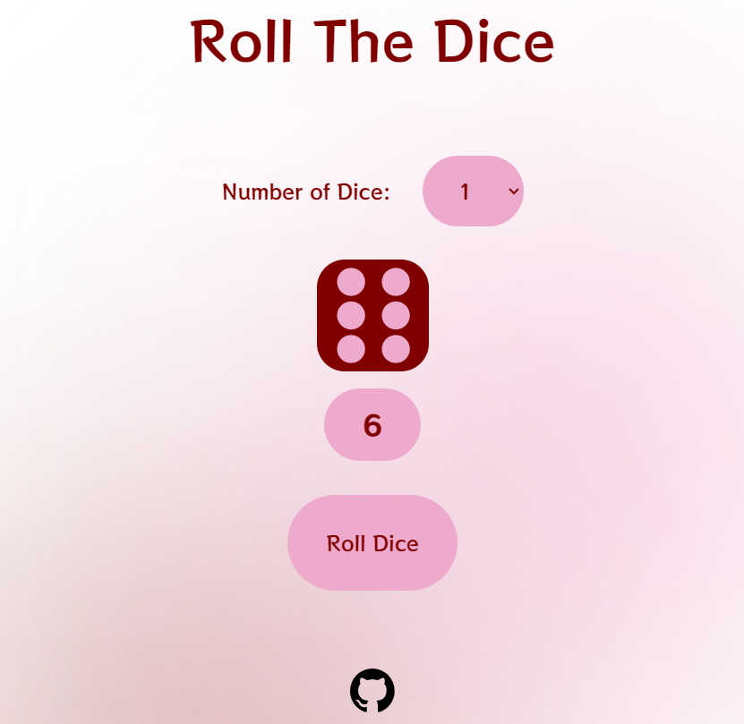
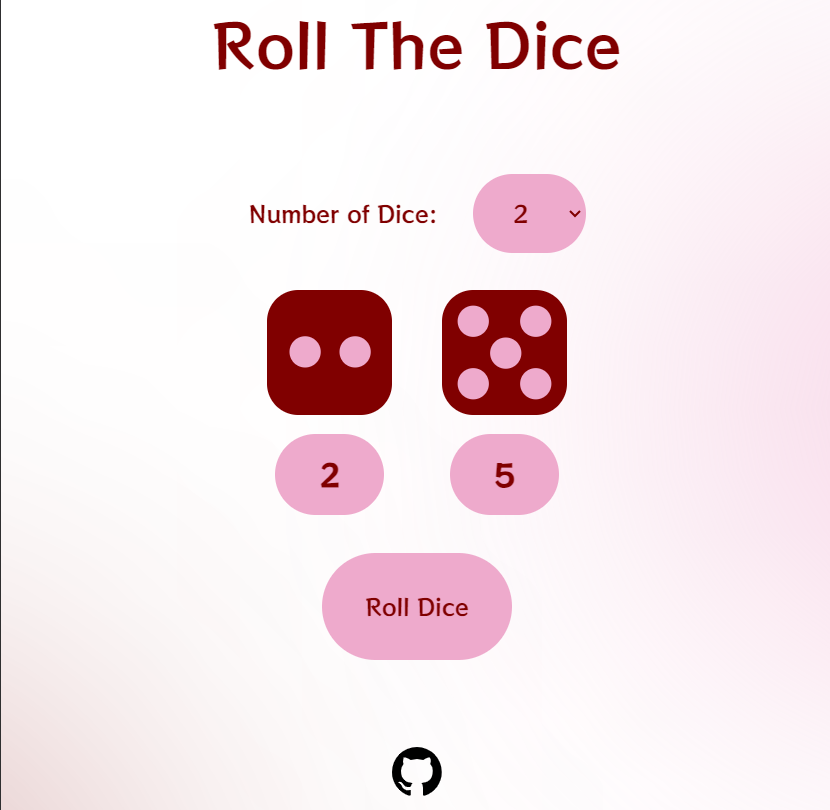

# Roll the Dice Web Game

[**PLAY GAME**](https://rakeshkanna-rk.github.io/RollTheDice/
)

Welcome to Roll the Dice! This is a simple web-based game where users can roll one or two dice.

## How to Play

- Select the number of dice you want to roll (1 or 2).
- Click the "Roll" button to roll the dice.
- The result of the roll will be displayed on the screen.
- You can roll again as many times as you like.

## Technologies Used

- HTML
- CSS
- JavaScript

## Demo

You can see a live demo of the game [**HERE**](https://rakeshkanna-rk.github.io/RollTheDice/
).

## Screenshots

    
    

## Contributing

Contributions are welcome! If you have any ideas for improvements or find any issues, feel free to open an issue or create a pull request.

## License

**Author** : Rakesh Kanna

This project is licensed under the [**MIT License**](LICENSE)
